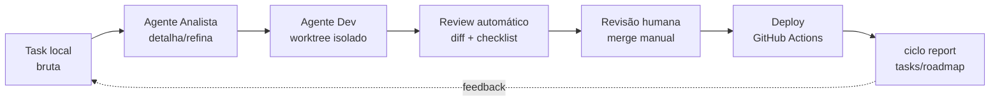

# ciclo — Framework de IA para times de desenvolvimento

Framework que conecta **JIRA + GitHub + agentes de IA** para operar o ciclo completo
de desenvolvimento: criação, detalhamento e refinamento de tasks → leitura/execução
por agentes → revisão de código → deploy → observabilidade da evolução de tasks e roadmap.

**Status:** 🚧 Spec v0.1 — em definição
**Início:** Agosto/2026
**Autor:** Guionardo Furlan

---

## Decisões fundamentais (v0.1)

|| # | Decisão | Escolha |
||---|---|---|
|| D1 | Relação com L3A | Projeto novo e independente; pode compartilhar ideias (hub de contexto, padrões), mas não está atrelado ao cliente L3A |
|| D2 | JIRA | Jira Cloud existe, mas **sem acesso na fase inicial** — adaptador fica para fase posterior |
|| D3 | Runtime dos agentes | Hermes Agent + opencode (ambos, papéis distintos) |
|| D4 | Time alvo | Time pequeno de desenvolvimento |
|| D5 | Stack do framework | Node.js + TypeScript (React para dashboards futuros); projetos alvo em JS/TS |
|| D6 | Banco de dados | **SQL Server** como padrão dos projetos alvo; PostgreSQL e MySQL no radar — camada de dados aberta |
|| D7 | Deploy | GitHub Actions já funciona nos projetos; o framework **observa** (integração posterior) |
|| D8 | Estratégia v0.1 | **Local-first**: framework instalado no ambiente de um desenvolvedor piloto; tasks em arquivos locais; sem dependência de APIs externas. Integrações JIRA/GitHub entram depois, como adaptadores plugáveis |
|| D9 | Contexto atual dos projetos | Repositórios existentes com aplicações desenvolvidas; fluxo de desenvolvimento manual (única automação: deploy via GitHub Actions) |
||| D10 | Setup | Wizard interativo (`ciclo init`) que valida/instala as CLIs oficiais (`acli` + `gh`, auto-instala se ausente) e exige Jira autenticado via ACLI; `ciclo doctor` para diagnóstico |
|| D11 | Credenciais | Fora do repositório do projeto, em `~/.ciclo/credentials.json` — compartilhadas entre projetos; config não-sensível versionada em `<repo>/.ciclo/config.json` |
|| D12 | Decisões da IA | Registradas no repo do produto em `docs/ciclo/decisoes/` (mini-ADRs) + `CHANGELOG-IA.md` — documentação e changelog específicos do que os agentes fizeram |

---

## Documentos

- [SPEC.md](SPEC.md) — Arquitetura: componentes, fluxo do ciclo, agentes, integrações
- [ROADMAP.md](ROADMAP.md) — Fases de evolução (Parte I: piloto local; Parte II: integrações)

---

## O ciclo em uma frase

> Uma task nasce como arquivo local bruto, sai detalhada e validada pelo agente de análise,
> é executada por um agente de código num branch isolado, passa por revisão automatizada + humana,
> vai a deploy via pipeline GitHub Actions existente, e o roadmap reflete o estado real.

**v0.1 é local-first:** roda no ambiente de um desenvolvedor piloto, sobre os
repositórios existentes do time, sem depender de APIs externas. Jira Cloud e
GitHub entram depois, como adaptadores plugáveis (`JiraTaskStore`,
`GithubVcsAdapter`).



## Instalação

### 1. Pré-requisitos

O ciclo usa duas CLIs oficiais para as integrações:

| CLI | Uso no ciclo | Obrigatória? |
|---|---|---|
| **acli** (Atlassian CLI) | Jira (buscar/criar/editar tasks) | ✅ Sim (via `ciclo init`) |
| **gh** (GitHub CLI) | GitHub (branch/push/PR) | ⚠️ Recomendada |

> `ciclo init` detecta CLIs ausentes e oferece instalação automática por sistema
> operacional — ou mostra as instruções manuais abaixo.

### 2. Instalar a `acli` (Atlassian CLI)

**macOS (Homebrew):**
```bash
brew tap atlassian/homebrew-acli
brew install acli
```

**macOS/Linux (binário, sem Homebrew):**
```bash
# macOS Apple Silicon
curl -sL "https://acli.atlassian.com/darwin/latest/acli_darwin_arm64/acli" -o acli
# macOS Intel
curl -sL "https://acli.atlassian.com/darwin/latest/acli_darwin_amd64/acli" -o acli
# Linux x86-64 / ARM64
curl -sL "https://acli.atlassian.com/linux/latest/acli_linux_amd64/acli" -o acli   # ou acli_linux_arm64
chmod +x acli
sudo mv acli /usr/local/bin/acli   # ou: mkdir -p ~/.local/bin && mv acli ~/.local/bin/acli
```

**Windows (PowerShell):**
```powershell
Invoke-WebRequest -Uri https://acli.atlassian.com/windows/latest/acli_windows_amd64/acli.exe -OutFile acli.exe
# x86-64 / ARM64: acli_windows_arm64/acli.exe
Move-Item .\acli.exe <pasta-em-PATH>\acli.exe   # ex.: C:\Users\voce\bin
```

**Linux (apt – Debian/Ubuntu):**
```bash
sudo apt-get install -y wget gnupg2
sudo mkdir -p -m 755 /etc/apt/keyrings
wget -nv -O- https://acli.atlassian.com/gpg/public-key.asc | sudo gpg --dearmor -o /etc/apt/keyrings/acli-archive-keyring.gpg
sudo chmod go+r /etc/apt/keyrings/acli-archive-keyring.gpg
echo "deb [arch=$(dpkg --print-architecture) signed-by=/etc/apt/keyrings/acli-archive-keyring.gpg] https://acli.atlassian.com/linux/deb stable main" | sudo tee /etc/apt/sources.list.d/acli.list > /dev/null
sudo apt update
sudo apt install -y acli
```

**Linux (RPM – Red Hat/Fedora):**
```bash
sudo yum install -y yum-utils
sudo yum-config-manager --add-repo https://acli.atlassian.com/linux/rpm/acli.repo
sudo yum install -y acli
```

Documentação oficial: https://developer.atlassian.com/cloud/acli/guides/install-acli/

### 3. Instalar o `gh` (GitHub CLI)

**macOS:**
```bash
brew install gh
```

**Windows:**
```powershell
winget install --id GitHub.cli -e
# ou: choco install gh  /  scoop install gh
```

**Linux (Debian/Ubuntu):**
```bash
(type -p wget >/dev/null || (sudo apt update && sudo apt-get install wget -y))
sudo mkdir -p -m 755 /etc/apt/keyrings
wget -qO- https://cli.github.com/packages/githubcli-archive-keyring.gpg | sudo tee /etc/apt/keyrings/githubcli-archive-keyring.gpg > /dev/null
sudo chmod go+r /etc/apt/keyrings/githubcli-archive-keyring.gpg
echo "deb [arch=$(dpkg --print-architecture) signed-by=/etc/apt/keyrings/githubcli-archive-keyring.gpg] https://cli.github.com/packages stable main" | sudo tee /etc/apt/sources.list.d/github-cli.list > /dev/null
sudo apt update
sudo apt install gh -y
```

**Linux (Fedora/RHEL):**
```bash
sudo dnf install -y 'dnf-command(config-manager)'
sudo dnf config-manager --add-repo https://cli.github.com/packages/rpm/gh-cli.repo
sudo dnf install -y gh
```

Documentação oficial: https://cli.github.com/

### 4. Autenticação

```bash
# Jira (via ACLI – OAuth no navegador)
acli jira auth login --web

# Se preferir API token
# echo "$TOKEN" | acli jira auth login --site "sua-empresa.atlassian.net" --email "voce@empresa.com" --token

# GitHub (via gh CLI)
gh auth login
```

Verifique tudo com:
```bash
acli jira auth status
gh auth status
```

### 5. Instalar a CLI ciclo

1. Clone o repositório do framework:
    ```bash
    git clone <URL_DO_REPOSITORIO_CICLO>
    cd ciclo/cli
    ```

2. Instale as dependências:
    - Com npm: `npm install`
    - Com bun: `bun install`
    - Com pnpm: `pnpm install`

3. Linke a CLI globalmente:
    - Com npm: `npm link`
    - Com bun: `bun link`
    - Com pnpm: `pnpm link --global`

4. Inicialize em um projeto:
    ```bash
    cd /caminho/para/seu/projeto
    ciclo init          # wizard interativo (instala CLIs se faltarem, configura Jira)
    ciclo init -y       # aceita padrões
    ```

> Credenciais **nunca** ficam no repositório: a sessão da ACLI vive na HOME do usuário
> (`~/.config/acli`) e a do `gh` em seu keyring — o projeto guarda apenas
> configuração não-sensível em `.ciclo/config.json`.

---

1. **Task local é a fonte da verdade do *quê* e do *estado*** (vira issue no Jira na fase 2+); o git do projeto é a fonte do *código*.
2. **Agentes nunca pulam estados** — transições de task seguem o workflow definido.
3. **Humano no loop nos pontos caros** — aprovação de spec refinada e merge são sempre humanos.
4. **Adaptadores, não acoplamento** — nada fala direto com Jira/GitHub; tudo passa pelas interfaces `TaskStore`/`VcsAdapter`, com implementação local hoje e remota amanhã.
5. **Tudo rastreado** — cada ação de agente deixa registro (evento em `events.jsonl`, commit na branch, log).
6. **Segredo nunca versionado** — credenciais vivem fora do repo (`~/.ciclo/`); o que vai no repo é só config não-sensível.
7. **A IA documenta as próprias decisões** — toda escolha técnica relevante vira mini-ADR em `docs/ciclo/decisoes/` e entra no `CHANGELOG-IA.md`.

---

## Integração com Jira (via ACLI)

O ciclo interage com o Jira **exclusivamente pela ACLI oficial** (Atlassian CLI) — sem
tokens no projeto. A autenticação é OAuth (ou API token opcional), e a sessão fica na
HOME do usuário (`~/.config/acli`).

```bash
# Autenticar (uma vez por máquina)
acli jira auth login --web

# Verificar
acli jira auth status
ciclo doctor   # mostraria: Jira: ✅ Connection: OK (via ACLI)
```

### Workflow de tasks

```bash
ciclo show FW-123            # busca no Jira e salva localmente (se não existir)
ciclo new "Minha feature"    # cria localmente E no Jira (projeto do config + label do repo)
ciclo new "Bugfix" --type Bug # define o tipo de issue (Epic, Feature, Story, Task, Bug)
ciclo new "Story k8s" --parent FW-9  # vincula a issue pai (hierarquia: Epic→Feature→Story→Task)
ciclo move <id> em_execução  # atualiza local + sincroniza status no Jira (ação via ACLI)
ciclo move <id>              # sem estado: descobre as lanes que a issue pode adotar e pergunta
ciclo sync                   # puxa do Jira as tasks com o label deste repositório
ciclo report                 # observabilidade local (estados, idade, branches, atividade)
ciclo report --jira          # + mescla dados do Jira (assignee, prioridade, status, labels)
ciclo list                   # tasks locais (inclui as importadas do Jira)
ciclo doctor                 # valida ACLI + gh + conexões
ciclo instrucoes             # exibe AGENTS.md (projeto+global) e o resumo das skills habilitadas
ciclo instrucoes --texto     # inclui o conteúdo integral de cada SKILL.md
ciclo instrucoes --check     # só lista quais arquivos/skills existem
```

### Hierarquia de issue types (Jira)

Ao criar uma issue (`ciclo new`), você pode escolher o tipo. **Default: `Task`.**

| Nível | Tipo | Pode conter | Descrição |
|---|---|---|---|
| 1 | **Epic** | Feature, Story, Task, Bug | Grande entregável / tema |
| 2 | **Feature** | Story, Task, Bug | Funcionalidade concreta |
| 3 | **Story** | Task, Bug | Necessidade com valor de negócio |
| 4 | **Task** *(default)* | — | Unidade de trabalho |
| 4 | **Bug** | — | Correção de defeito |

Como escolher:
- `ciclo new "descrição"` → pergunta o tipo (menu interativo, default `Task`)
- `ciclo new "descrição" --type Story` → usa direto (aceita minúsculas)
- Default por projeto: `config.services.jira.issueType = "Story"` (pula o prompt)

### Vínculo repositório ↔ label

Cada task sincronizada com o Jira é marcada com o **label do repositório local**
(derivado do remote `origin` ou do nome do diretório, ex.: `test-piloto-zero`,
`ciclo`). Isso garante que:

- **Local → Jira** (`ciclo new`): a issue criada no Jira recebe o label do repo.
- **Jira → Local** (`ciclo show`, `ciclo sync`): só tasks **com o label deste repo**
  são consideradas tasks deste repositório — importa sem duplicar as que já existem
  localmente e ignora issues de outros repos.
- **Task sem o label do repo**: ao puxar uma issue do Jira que **não tem** o label,
  o ciclo **pergunta se você quer adicioná-lo** (ex.: `Deseja atualizá-la no Jira?`).
  Isso só acontece quando a pasta atual é um **repositório git** — fora de um repo,
  a issue é importada sem alterar o Jira.

O label pode ser sobrescrito com a env var `CICLO_REPO_LABEL`.

### Arquivos que o ciclo cria (e o `.gitignore`)

| Arquivo/Pasta | Versionar? | Motivo |
|---|---|---|
| `.ciclo/config.json` | ✅ Sim | config não-sensível (serviços, statusMap, etc.) |
| `.ciclo/tasks/` | ❌ Não | tasks locais (espelho do Jira) |
| `.ciclo/state.json` | ❌ Não | lockfile do fingerprint |
| `.ciclo/logs/`, `events.jsonl` | ❌ Não | evento/auditoria local |
| `.env`, `.env.local` | ❌ Não | overrides opcionais de config |

O `ciclo init` adiciona automaticamente essas entradas ao `.gitignore`
(deduplicado — rodar `ciclo init` de novo não duplica o bloco).

### Mapeamento de status (ciclo → Jira)

| Estado ciclo | Status Jira (default) |
|---|---|
| `backlog` | To Do |
| `refinando` | To Do |
| `pronta` | To Do |
| `em_execução` | In Progress |
| `revisao` | In Review |
| `concluida` | Done |

Para adaptar ao workflow do seu projeto Jira, defina `statusMap` no config:

```json
{
  "services": {
    "jira": {
      "statusMap": { "pronta": "READY FOR CODE REVIEW", "concluida": "Closed" }
    }
  }
}
```

---

*Elaborado por: Hermes Agent (analista de IA) – data: 2026‑08‑26 (atualizado com ACLI).*