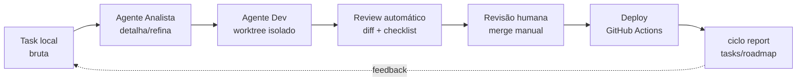

# ciclo — Framework de IA para times de desenvolvimento

Framework que conecta **JIRA + GitHub + agentes de IA** para operar o ciclo completo
de desenvolvimento: criação, detalhamento e refinamento de tasks → leitura/execução
por agentes → revisão de código → deploy → observabilidade da evolução de tasks e roadmap.
Multi-OS: **Linux, macOS e Windows**.

**Status:** 🚧 Spec v0.1 — piloto · **Autor:** Guionardo Furlan

---

## 🚀 Início rápido

Pré-requisito: **Node.js 20+**, `git` e o **Hermes Agent** (o agente que opera o
ciclo no chat — instale com `curl -fsSL https://hermes-agent.nousresearch.com/install.sh | bash`
no Linux/macOS, ou `iex (irm https://hermes-agent.nousresearch.com/install.ps1)` no Windows/PowerShell).
As CLIs (`acli` p/ Jira e `gh` p/ GitHub) são instaladas/validadas automaticamente pelo wizard.

```bash
# 1. Instalar a CLI direto do repositório GitHub
npm install -g guionardo/ciclo
ciclo --version                    # → 0.1.0

# 2. Instalar as skills do framework no Hermes (1ª vez)
ciclo skills install

# 3. Inicializar um projeto de dev
cd /caminho/para/seu/repositorio
ciclo init -y                      # wizard interativo: ciclo init

# 4. Criar a primeira task (local + issue no Jira)
ciclo new "Minha primeira feature"
```

Para atualizar depois: `npm install -g guionardo/ciclo@main` — a CLI avisa
sozinha quando há versão nova (1×/dia) e `ciclo update-check` mostra o changelog.

> 📖 Quer o passo a passo completo numa máquina nova? Veja o
> [ROTEIRO-REPLICACAO.md](docs/ciclo/ROTEIRO-REPLICACAO.md).

---

## O ciclo em uma frase

> Uma task nasce como arquivo local bruto, sai detalhada e validada pelo agente de análise,
> é executada por um agente de código num branch isolado, passa por revisão automatizada + humana,
> vai a deploy via pipeline GitHub Actions existente, e o roadmap reflete o estado real.

**v0.1 é local-first:** roda no ambiente de um desenvolvedor piloto, sobre os
repositórios existentes do time. Jira e GitHub entram via **CLIs oficiais**
(ACLI + gh) — credenciais nunca ficam no repo.



---

## Fluxo do dia a dia

```
ciclo new "descrição"          # 1. criar (local + Jira, label do repo + lang:<stack>)
ciclo refine <id>              # 2. refinar (detalhar, critérios) — ou pelo agente (chat)
ciclo start <id>               # 3. iniciar: branch TASK/<id>-<slug> + Jira → IN PROGRESS
... implementação no código ... # 4. desenvolver no branch
ciclo move <id> revisao        # 5. Jira → IN REVIEW (pedido de review)
ciclo move <id> concluida      # 6. Jira → DONE (merge manual na main)
ciclo report --jira            # 7. ver o board/roadmap
```

**Refinamento assistido pelo agente** (ADR-002) — você conversa, o agente opera:

1. **Contexto** — o agente roda `ciclo contexto <id>` (task + parents Jira + código).
2. **Proposta** — propõe o plano no chat (🎯 objetivo · 🪜 passos · 📦 resultado esperado · 📝 critérios).
3. **Aprovação** — você revisa e aprova no chat.
4. **Aplicação** — `ciclo refine <id> --plan '<json>'` salva local e sincroniza o Jira (descrição + label `refined`).

> 👨‍💻 O [GUIA-DEV.md](docs/ciclo/GUIA-DEV.md) tem o manual completo do dev:
> primeiros comandos, exemplos de prompts para o agente e troubleshooting.

---

## Comandos

```bash
ciclo list                     # tasks locais (inclui as importadas do Jira)
ciclo new "descrição" [--type Story] [--parent FW-9]
ciclo show <id>                # id local (a1b2c3d4) ou chave Jira (FW-27)
ciclo contexto <id>            # material p/ o agente refinar (task + parents + código)
ciclo refine <id> [--plan '<json>']
ciclo start <id>               # gateia na label refined; branch + Jira IN PROGRESS
ciclo move <id> [estado]       # backlog | refinando | pronta | em_execução | revisao | concluida
ciclo sync                     # puxa do Jira as tasks com o label deste repositório
ciclo report [--jira]          # observabilidade (local / mesclada com Jira)
ciclo doctor                   # valida ACLI + gh + conexões
ciclo update-check             # nova versão da CLI + changelog (--json / --forcar)
ciclo skills list|install      # skills do framework em ~/.hermes/skills/
ciclo instrucoes [--texto] [--check]   # o que é passado ao agente
```

---

## Documentos

| Documento | Pra quê |
|---|---|
| [docs/ciclo/GUIA-DEV.md](docs/ciclo/GUIA-DEV.md) | **Manual do desenvolvedor** — instalação, comandos, fluxo e uso pelo agente |
| [docs/ciclo/ROTEIRO-REPLICACAO.md](docs/ciclo/ROTEIRO-REPLICACAO.md) | Instalar o ciclo numa máquina nova (checklist por etapa) |
| [docs/ciclo/DECISOES-FUNDAMENTAIS.md](docs/ciclo/DECISOES-FUNDAMENTAIS.md) | Decisões fundamentais (D1–D12) |
| [SPEC.md](SPEC.md) | Arquitetura: componentes, fluxo, agentes, integrações |
| [ROADMAP.md](ROADMAP.md) | Fases de evolução |
| [docs/ciclo/decisoes/](docs/ciclo/decisoes/) | ADRs das decisões arquiteturais (ADR-001 a ADR-004) |
| [docs/ciclo/CHANGELOG-IA.md](docs/ciclo/CHANGELOG-IA.md) | Registro das ações dos agentes |
| [skills/](skills/) | Skills do framework empacotadas (`ciclo skills install`) |

---

## Instalação detalhada

### Pré-requisitos

| CLI | Uso no ciclo | Obrigatória? |
|---|---|---|
| **Hermes Agent** | runtime do agente (lê AGENTS.md, roda `ciclo contexto`, refina no chat) | ✅ Sim |
| **acli** (Atlassian CLI) | Jira (buscar/criar/editar tasks) | ✅ Sim (via `ciclo init`) |
| **gh** (GitHub CLI) | GitHub (branch/push/PR) | ✅ Sim (via `ciclo init`, exige autenticação) |

> `ciclo init` detecta CLIs ausentes e oferece instalação automática por sistema
> operacional — ou mostra as instruções manuais abaixo. O Hermes instala-se com
> `curl -fsSL https://hermes-agent.nousresearch.com/install.sh | bash`
> (Linux/macOS) ou `iex (irm https://hermes-agent.nousresearch.com/install.ps1)`
> (Windows/PowerShell).

### Instalar a `acli` (Atlassian CLI)

**macOS (Homebrew):**
```bash
brew tap atlassian/homebrew-acli
brew install acli
```

**macOS/Linux (binário, sem Homebrew):**
```bash
# macOS Apple Silicon
curl -sL "https://acli.atlassian.com/darwin/latest/acli_darwin_arm64/acli" -o acli
# macOS Intel
curl -sL "https://acli.atlassian.com/darwin/latest/acli_darwin_amd64/acli" -o acli
# Linux x86-64 / ARM64
curl -sL "https://acli.atlassian.com/linux/latest/acli_linux_amd64/acli" -o acli   # ou acli_linux_arm64
chmod +x acli
sudo mv acli /usr/local/bin/acli   # ou: mkdir -p ~/.local/bin && mv acli ~/.local/bin/acli
```

**Windows (PowerShell):**
```powershell
Invoke-WebRequest -Uri https://acli.atlassian.com/windows/latest/acli_windows_amd64/acli.exe -OutFile acli.exe
# x86-64 / ARM64: acli_windows_arm64/acli.exe
Move-Item .\acli.exe <pasta-em-PATH>\acli.exe   # ex.: C:\Users\voce\bin
```

**Linux (apt – Debian/Ubuntu):**
```bash
sudo apt-get install -y wget gnupg2
sudo mkdir -p -m 755 /etc/apt/keyrings
wget -nv -O- https://acli.atlassian.com/gpg/public-key.asc | sudo gpg --dearmor -o /etc/apt/keyrings/acli-archive-keyring.gpg
sudo chmod go+r /etc/apt/keyrings/acli-archive-keyring.gpg
echo "deb [arch=$(dpkg --print-architecture) signed-by=/etc/apt/keyrings/acli-archive-keyring.gpg] https://acli.atlassian.com/linux/deb stable main" | sudo tee /etc/apt/sources.list.d/acli.list > /dev/null
sudo apt update
sudo apt install -y acli
```

**Linux (RPM – Red Hat/Fedora):**
```bash
sudo yum install -y yum-utils
sudo yum-config-manager --add-repo https://acli.atlassian.com/linux/rpm/acli.repo
sudo yum install -y acli
```

Documentação oficial: https://developer.atlassian.com/cloud/acli/guides/install-acli/

### Instalar o `gh` (GitHub CLI)

**macOS:**
```bash
brew install gh
```

**Windows:**
```powershell
winget install --id GitHub.cli -e
# ou: choco install gh  /  scoop install gh
```

**Linux (Debian/Ubuntu):**
```bash
(type -p wget >/dev/null || (sudo apt update && sudo apt-get install wget -y))
sudo mkdir -p -m 755 /etc/apt/keyrings
wget -qO- https://cli.github.com/packages/githubcli-archive-keyring.gpg | sudo tee /etc/apt/keyrings/githubcli-archive-keyring.gpg > /dev/null
sudo chmod go+r /etc/apt/keyrings/githubcli-archive-keyring.gpg
echo "deb [arch=$(dpkg --print-architecture) signed-by=/etc/apt/keyrings/githubcli-archive-keyring.gpg] https://cli.github.com/packages stable main" | sudo tee /etc/apt/sources.list.d/github-cli.list > /dev/null
sudo apt update
sudo apt install gh -y
```

**Linux (Fedora/RHEL):**
```bash
sudo dnf install -y 'dnf-command(config-manager)'
sudo dnf config-manager --add-repo https://cli.github.com/packages/rpm/gh-cli.repo
sudo dnf install -y gh
```

Documentação oficial: https://cli.github.com/

### Autenticação

```bash
# Jira (via ACLI – OAuth no navegador)
acli jira auth login --web

# Se preferir API token
# echo "$TOKEN" | acli jira auth login --site "sua-empresa.atlassian.net" --email "voce@empresa.com" --token

# GitHub (via gh CLI)
gh auth login
```

Verifique tudo com:
```bash
acli jira auth status
gh auth status
```

### Instalar a CLI ciclo

**Opção rápida — direto do repositório GitHub (recomendado):**

```bash
npm install -g guionardo/ciclo    # instala a CLI globalmente (bin `ciclo`)
ciclo --version                   # valida (→ 0.1.0)
```

> O npm instala o pacote `@ciclo/cli` direto do repo (mesma coisa que
> `npm install -g github:guionardo/ciclo`). Depois:
> ```bash
> ciclo skills install        # copia skills/ → ~/.hermes/skills/ (1ª vez)
> ciclo init -y               # inicializa o projeto
> ```
> **Atualizar depois:** `npm install -g guionardo/ciclo@main` — ou rode
> `ciclo update-check` para ver se há versão nova + changelog.

**Opção local (para contribuir/desenvolver):**

```bash
git clone <URL_DO_REPOSITORIO_CICLO>
cd ciclo/cli
npm install          # ou: bun install / pnpm install
npm link             # ou: bun link / pnpm link --global
```

> Credenciais **nunca** ficam no repositório: a sessão da ACLI vive na HOME do usuário
> (`~/.config/acli`) e a do `gh` em seu keyring — o projeto guarda apenas
> configuração não-sensível em `.ciclo/config.json`.

---

## Checagem periódica de versão

A CLI verifica **automaticamente** (1×/dia, silenciosa) se há versão nova no
repositório GitHub — quando existe, mostra um aviso discreto:

```
⚡ Nova versão da CLI ciclo disponível: 0.1.0 → 0.2.0
   Rode `ciclo update-check` para ver o changelog, ou atualize com:
   npm install -g guionardo/ciclo@0.2.0
```

- Desligue com `CICLO_SKIP_UPDATE_CHECK=1` (ou em CI é ignorada).
- `ciclo update-check` mostra o changelog: body da última **GitHub Release**
  quando existir; sem releases, as entradas recentes do `CHANGELOG-IA.md` da
  main.
- Dica: crie uma **GitHub Release** por versão (`gh release create v0.2.0`)
  — o changelog da release passa a ser exibido e o update usa `@v0.2.0`.

---

## Integração com Jira (via ACLI)

O ciclo interage com o Jira **exclusivamente pela ACLI oficial** (Atlassian CLI) — sem
tokens no projeto. A autenticação é OAuth (ou API token opcional), e a sessão fica na
HOME do usuário (`~/.config/acli`).

```bash
# Autenticar (uma vez por máquina)
acli jira auth login --web

# Verificar
acli jira auth status
ciclo doctor   # mostraria: Jira: ✅ Connection: OK (via ACLI)
```

### Labels automáticas

| Label | Origem | Exemplo |
|---|---|---|
| `<repo>` | vínculo repositório ↔ label (remote `origin`; env `CICLO_REPO_LABEL` p/ override) | `atendente-imoveis` |
| `lang:<stack>` | fingerprint do projeto (`stack.language` — JS/TS, .NET, Go, Python, Rust, PHP) | `lang:go`, `lang:dotnet` |
| `refined` | adicionada pelo `refine` (prontidão para execução) | `refined` |

### Hierarquia de issue types (Jira)

Ao criar uma issue (`ciclo new`), você pode escolher o tipo. **Default: `Task`.**

| Nível | Tipo | Pode conter | Descrição |
|---|---|---|---|
| 1 | **Epic** | Feature, Story, Task, Bug | Grande entregável / tema |
| 2 | **Feature** | Story, Task, Bug | Funcionalidade concreta |
| 3 | **Story** | Task, Bug | Necessidade com valor de negócio |
| 4 | **Task** *(default)* | — | Unidade de trabalho |
| 4 | **Bug** | — | Correção de defeito |

- `ciclo new "descrição"` → pergunta o tipo (menu interativo, default `Task`)
- `ciclo new "descrição" --type Story` → usa direto (aceita minúsculas)
- Default por projeto: `config.services.jira.issueType = "Story"` (pula o prompt)

### Vínculo repositório ↔ label

Cada task sincronizada com o Jira é marcada com o **label do repositório local**
(derivado do remote `origin` ou do nome do diretório). Isso garante que:

- **Local → Jira** (`ciclo new`): a issue criada no Jira recebe o label do repo.
- **Jira → Local** (`ciclo show`, `ciclo sync`): só tasks **com o label deste repo**
  são consideradas — importa sem duplicar e ignora issues de outros repos.
- **Task sem o label do repo**: o ciclo **pergunta se você quer adicioná-lo**
  (quando a pasta atual é um repositório git).

O label pode ser sobrescrito com a env var `CICLO_REPO_LABEL`.

### Arquivos que o ciclo cria (e o `.gitignore`)

| Arquivo/Pasta | Versionar? | Motivo |
|---|---|---|
| `.ciclo/config.json` | ✅ Sim | config não-sensível (serviços, statusMap, etc.) |
| `.ciclo/tasks/` | ❌ Não | tasks locais (espelho do Jira) |
| `.ciclo/state.json` | ❌ Não | lockfile do fingerprint |
| `.ciclo/logs/`, `events.jsonl` | ❌ Não | evento/auditoria local |
| `.env`, `.env.local` | ❌ Não | overrides opcionais de config |

O `ciclo init` adiciona automaticamente essas entradas ao `.gitignore`
(deduplicado — rodar `ciclo init` de novo não duplica o bloco).

### Mapeamento de status (ciclo → Jira)

| Estado ciclo | Status Jira (default) |
|---|---|
| `backlog` | To Do |
| `refinando` | To Do |
| `pronta` | To Do |
| `em_execução` | In Progress |
| `revisao` | In Review |
| `concluida` | Done |

Para adaptar ao workflow do seu projeto Jira, defina `statusMap` no config:

```json
{
  "services": {
    "jira": {
      "statusMap": { "pronta": "READY FOR CODE REVIEW", "concluida": "Closed" }
    }
  }
}
```

---

*Elaborado por: Hermes Agent (analista de IA) – data: 2026‑09‑02 (README como entrada rápida; decisões em docs/ciclo/DECISOES-FUNDAMENTAIS.md).*